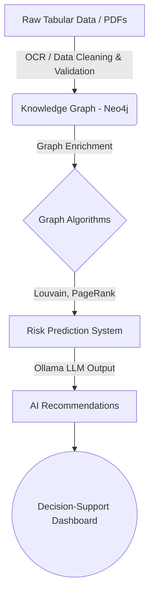

<div align="center">
  
# 🏛️ Civix AI
**AI-Powered Booth Civic Intelligence Platform**

[](https://fastapi.tiangolo.com/)
[](https://reactjs.org/)
[](https://neo4j.com/)
[](https://ollama.ai/)
[](https://vitejs.dev/)

Transforming static civic data into a **predictive, booth-level Living Knowledge Graph**.

[Explore Backend Documentation](./backend/README.md) • [Explore Frontend Documentation](./frontend/README.md)

</div>

---

## 🌟 Overview

**Civix AI** is an advanced Civic Intelligence Platform engineered to modernize how local governments and civic leaders understand, predict, and respond to community needs. By aggregating flat datasets regarding voters and localized complaints, Civix AI constructs a highly interconnected **Knowledge Graph**. 

Moving beyond traditional reactive complaint management, Civix AI empowers decision-makers with:

- 🎯 **Booth-level Risk Prediction**: Anticipate issues before they escalate.
- 🕸️ **Structural Community Detection**: Understand hidden relationships within civic data.
- 🔢 **Civic Score Computation**: Evaluate community health using dynamically calculated scores based on accurate, real-time node metrics.
- 🤖 **AI-Based Recommendations**: Receive actionable, localized deployment strategies.
- 📊 **Decision-Support Dashboard**: A modern, glassmorphic UI for real-time visualization and natural-language "Ask AI" queries.

---

## 🧠 Core Architecture

The platform is designed to process, enrich, and visualize raw data at scale.



---

## 🔬 AI & Data Pipeline

Our intelligence engine is powered by four main pillars:

### 1. Graph Intelligence (Neo4j)
- **Louvain Clustering**: Identifies structural community groups based on interaction data.
- **PageRank Centrality**: Highlights the most significant nodes (hubs) in civic complaint chains.
- **Cluster Density Detection**: Uncovers highly dense problem areas in real-time.

### 2. Predictive Risk Modeling
- Evaluates booth-level risk scores based on complaint growth rates, resolution delays, and localized sentiment.
- Dynamically assigns risk categories (e.g., Low, Medium, High).

### 3. NLP & Secure Cypher Generation (Ollama)
- Translates natural language questions into highly-optimized, **strictly read-only** Neo4j Cypher queries. 
- Employs self-correcting logic to enforce case-insensitive graph traversals, prevents mutating queries (DELETE/CREATE), and summarizes output into conversational answers.
- Provides actionable, natural-language insights directly to the dashboard (e.g., *"Deploy inspection team immediately."*).

### 4. Automated Data Ingestion (OCR)
- Processes raw Voter PDF lists into structured Neo4j nodes using Optical Character Recognition (Tesseract) and high-speed multi-threaded bounding-box extraction.
- Continuously watches for data file updates to automatically re-seed the graph.

---

## 📂 Project Structure

This is a monorepo containing both the FastAPI graphical backend and the React frontend.

```text
civix_ai/
 ├── backend/            # FastAPI, Neo4j connection, LLM integration, OCR pipeline
 │   ├── app/            # Main application logic & endpoints
 │   ├── data/           # Uploaded CSVs and pipeline data
 │   ├── scripts/        # Database seeding & utility scripts
 │   ├── tests/          # Robust backend test suite (pytest)
 │   ├── requirements.txt
 │   └── README.md       # Backend-specific instructions
 │
 ├── frontend/           # React + Vite application
 │   ├── src/            # Components, pages, charts & interactive network graphs
 │   ├── package.json
 │   └── README.md       # Frontend-specific instructions
 │
 └── README.md           # You are here
```

---

## 🚀 Quick Start Guide

You can run the full application by spinning up both the backend and frontend servers independently.

### Step 1: Backend Setup
Make sure you have a running instance of Neo4j, Ollama, and system OCR dependencies.

```bash
cd backend
python -m venv .venv
source .venv/bin/activate  # On Windows: .venv\Scripts\activate
pip install -r requirements.txt

# Run the API server
uvicorn app.main:app --reload
```
*For detailed environment setup and OCR requirements, see the [Backend README](./backend/README.md).*

### Step 2: Frontend Setup

```bash
cd frontend
npm install

# Start the Vite development server
npm run dev
```
*For more frontend details, see the [Frontend README](./frontend/README.md).*

---

## 🔐 Ethical Design & Safety

Civix AI strictly enforces data privacy and ethical AI usage:

- 🛡️ **No Personal Profiling**: Data is anonymized and strictly aggregated at the booth or ward level.
- 🛡️ **No Mutating AI Queries**: The LLM prompt injection barriers are tightly scoped to completely block any commands that attempt to alter or destroy graph data.
- 🛡️ **Role-Based Access**: Designed for authorized civic administrators and planners.

---

## 🏆 Built For
Designed to set a new standard in **AI in Governance**. A highly scalable architecture tailored for Smart Cities, Decision Support Systems, and Civic Intelligence.
